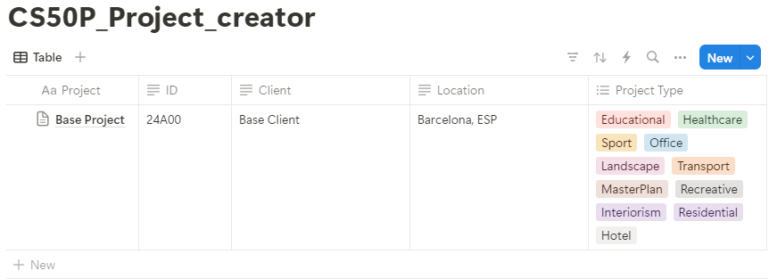
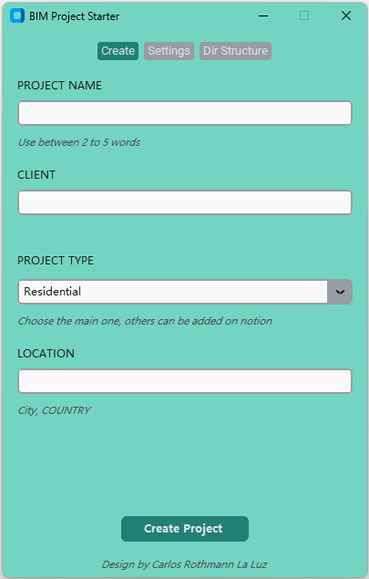
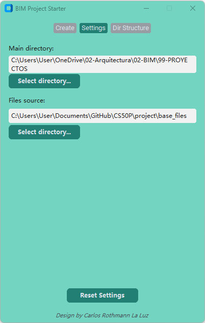
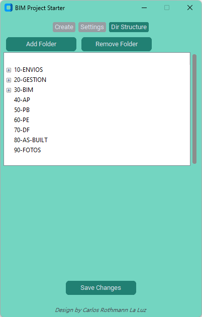
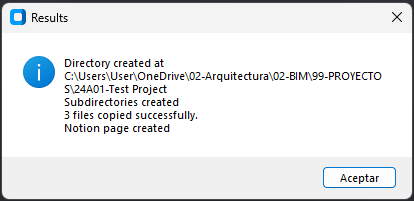
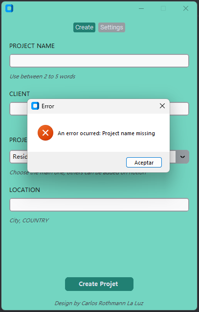

# PROJECT STARTER

#### Video Demo:  [Link](https://youtu.be/WWI5ycDSDFM)

## Description

This project is designed to automate the initial setup for Architectural BIM projects. Every project requires its files to be stored in a consistent directory, with predefined subfolders and a standardized naming system. This program creates a standard directory structure that can tailored to the offices need and also copies standard files into the appropriate subfolders.

Additionally, the program is integrated with a Notion database via the Notion API to help track projects life cicle.

Each project is automatically assigned a unique 5-digit ID, generated by the program. The ID format consists of the last two digits of the year, followed by a letter and two numbers (e.g., 24A00). The program checks the last used ID from the Notion database each time a new project is created to ensure sequential numbering of the ID's.

The program features an UI with 3 tabs. 

The first tabs "Creation" prompts the user to input four key parameters, which are then used to create the directory together with the entry on the Notion database. 

The second tab "Settings", allows users to specify the main directory where each project directory will be created and the path where the standard files are stored.

The third tab "Dir Structure", allows users to modified and set the structure of the directory that will be created.

Once the project its created, a message pops with the results. 

In case of a problem an error message will pop up. 

## Design choices and thinking process

* Functionality
    * At the beginning the final project was an automation to create directories base on a define structure for Architectural BIM Designs. I had the code ready and the testing ready but it was a little to plain and didn't add anything special. So i want to add some sort of database to store the projects and keep an organized system with unique ID's to keep track. On this aspect i find Notion a suitable web app to make an easy interactive database. So i added an another python file to the project to interact with Notion API. I kept this file separated for managing proporses. With this i was able to create an interaction with notion that was easy to test and adapt. When all of this was done, i decided that the program had to be user friendly for anyone. For this case instead of using a command line apporach i went with a GUI to prompt the user for specific information. This added an another aspect to the program and I choose to add a settings option to store some usefull information like the directory where to create the BIM directories and a directory where are the standard files needed for the every BIM project. On a final step i added a final tab with the directory structure. I wanted the end user to be able to manage a configure his own directory an avoid to hardcode the directory on the file. To manage all of this, the settings and directories are save on a json file and access via the project.py file.

* Design
    * Since i want the desing to be user friendly for anyone. I look throgh internet and find "clear-code" tutorilas on youtube on how to use tkinter to create interactive GUI. After finishid the tutorial I decided to do it with customtkinter for the more modern looking aspect. 

* Appearence
    * Since i want the desing to be user friendly for anyone. I look throgh internet and find "clear-code" tutorilas on youtube on how to use tkinter to create interactive GUI. After finishid the tutorial I decided to do it with customtkinter for the more modern looking aspect. 

* Testing
    * As explain before i had two testing files, on for the project and one for notion. I create pytest fixture on both file the have a more consisce file.
    The testing was done on the cs50p web enviroment as well on a Git repository on a windosws desktop to ensure a correct creation of the directories on diferents enviroments.

    On the case of the project test. I import the shutil library because i want to create only one directory always with the same name. So i had to check if there of one and errase it will the subdirectory and file, to create the new ones. I use this because i didn't want mocking files to assert the copy of the standard files. Every function on the project.py file its test. Instead of os i import the pathlib library to do all the asserting on files and directories. 

    For the notion test all the test are make to ensure a correct connection with the REST API, testing the key a url by separeted and all the function on the notion_connector.py

## Files and functions

* project.py
    * The main file where all components are combined. This file executes the GUI. When the confirmation button is clicked, the main function is called. It first collects data from Notion and the user inputs, checks the project name to avoid duplicates or invalid characters, and then reads the user_settings.json file to create the paths for the main directory and subdirectories. It includes error handling for copying files, and the final step is to create the project entry in Notion. I import messagebox from tk to inform via messages of any error with the inputs or the connection with Notion. On this file i added some constant variable like forbidden characters for the creation of directory or files on windows, linux or mac. Trying to eliminate corner cases and assure no problems for the final user. All the function for the name revision raise a ValueError that are return to the user via tk.messagebox. To ensure there are no problem with the directory creation by default the main directory it's set to the directory where the python file is located.

* test_project.py
    * The test of this files aim to assert the creation of directory and copy of the standard files. As well all the function preventing wrong names or directory for the program to work properly. 

* notion_conector.py
    * Contains the private API key, URL as constant that are imported into the project,py file. I create all the necessary functions to interact with the Notion API, for collecting data and creating new pages. This file had general function to interact with the API but the collection and creation function are configure for the specific Notion_DB i create for this project. The functions return any HTTP error that may occur during the requests. This is use in the project.py file via tk.messagebox to inform the user of any problem.

* test_notion.py
    * With this files i test.

* gui.py
    * Contains the classes responsible for creating the GUI framework. The classes combine widgets for better management of the GUI.

* gui_settings.py
    * Contains the fonts and colors for the "gui.py" file.

* user_settings.json
    * This file stores the paths for the main directory and the standard files.

## Dependencies

customtkinter

requests

## Author

Name and contact info

[@CarlosRothmann](www.linkedin.com/in/carlos-rothmann-la-luz)

## Version History

* 0.1
    * Initial Submission

## Acknowledgments

Inspiration, code snippets, etc.
* [clear-code-projects](https://github.com/clear-code-projects) for the GUI.